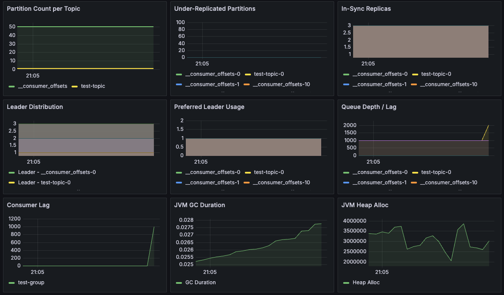

# 📊 Kafka Monitoring Dashboard (Prometheus + Grafana)

This project provides a setup to **monitor Kafka cluster metrics in real-time** using **Prometheus** for metric collection and **Grafana** for visualization.

> ⚠️ Note: This README was translated using a translation tool. Some parts may be unnatural or contain errors.


---

## ⚠️ Note

Currently, only **kafka-exporter** is used in this setup.  
As a result, **broker-level metrics** (e.g., CPU, network I/O, message throughput) are not included.

> To collect detailed broker metrics, it is recommended to add  
> **[JMX Exporter](https://github.com/prometheus/jmx_exporter)** to your Kafka brokers,  
> allowing you to collect JVM-based internal metrics (Broker, Topic, Producer, Consumer, etc.) as well.

---

## Setup

### Start Docker Containers
```
docker compose up -d
```

### Create Kafka Topic
```
docker compose exec kafka1 bash

kafka1 kafka-topics --create \
  --topic test-topic \
  --bootstrap-server kafka1:9092,kafka2:9093,kafka3:9094 \
  --replication-factor 3 \
  --partitions 3
```
---

### Grafana Data Source Configuration

Add Prometheus data source in Grafana.
   - **Name**: `Prometheus`
   - **Type**: Prometheus
   - **URL**: `http://prometheus:9090` (adjust to your environment)
   - **Access**: Server

---

### Import Grafana Dashboard

1. In Grafana, navigate to  
   **“+ (Create)” → “Import”**
2. Paste the JSON content below or upload the file:  
```
./setting/kafka-monitoring.json
```
---

### Client (Producer / Consumer)
You can run a simple producer and consumer to send and receive messages:
```
docker compose exec client sh

go mod init client
go get github.com/segmentio/kafka-go@latest
go mod tidy

go build -o client main.go

./client
```

## 📈 Key Dashboard Metrics

| Panel                       | Description                                                    |
| --------------------------- | -------------------------------------------------------------- |
| Partition Count per Topic   | Displays the number of partitions for each topic.              |
| Under-Replicated Partitions | Monitors partitions that are not fully replicated.             |
| In-Sync Replicas            | Shows the number of replicas currently in sync (ISR).          |
| Leader Distribution         | Displays the distribution of partition leaders across brokers. |
| Preferred Leader Usage      | Indicates whether partitions are using the preferred leader.   |
| Queue Depth / Lag           | Shows message backlog by partition offset differences.         |
| Consumer Lag                | Monitors message processing lag per consumer group.            |
| JVM GC Duration             | Visualizes the garbage collection duration of the exporter.    |
| JVM Heap Alloc              | Monitors heap memory usage of the exporter.                    |
